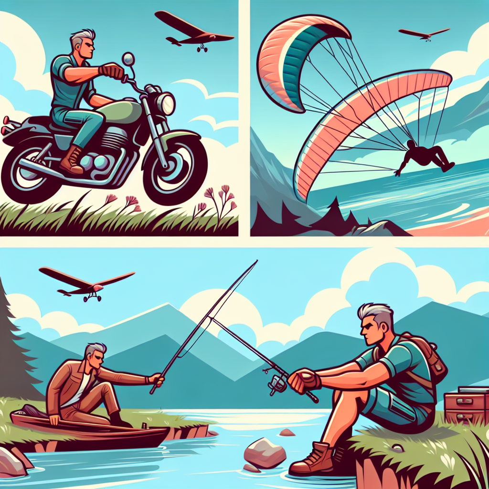
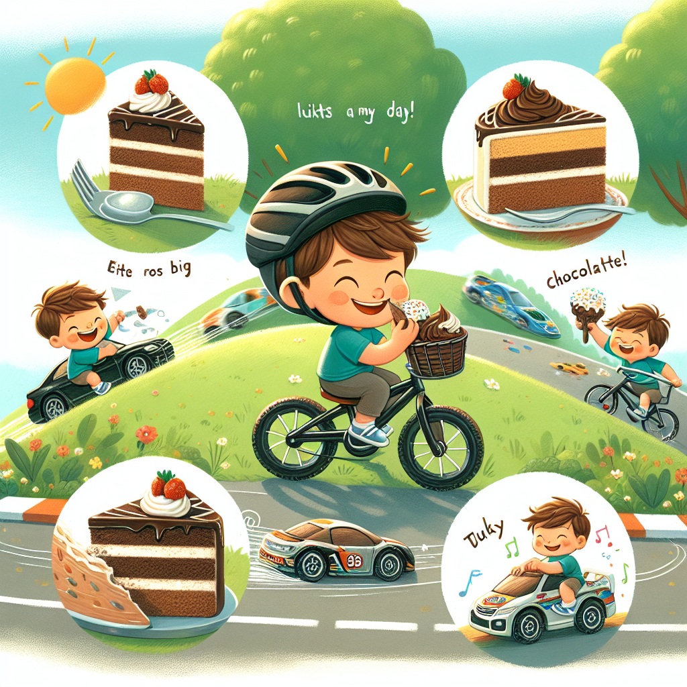

Flask app to experement with ChatGPT and Dall-E to see if it is able to generate a personalised story, along with a sequence of images that contain the same character.
# Flask app to experiment with ChatGPT and Dall-E

This Flask app is designed to experiment with the capabilities of ChatGPT and Dall-E. The goal is to see if the model is able to generate a personalized story, along with a sequence of images that contain the same character.

# Sequence

You input a few prompts for a story --> ChatGPT generates a story --> this prompt is also used by Dall-E to generate an image

# Using

Create a .env file containing your OpenAI key like

```
KEY=your_openai_key
```

run using Docker compose

```
docker compose build && docker compose up
```

Images and text are saved into  the`/result` folder
# Examples

Jamie is a thrill-seeker, full of zest,
With motorbikes, he feels his best.
Roaring engines, wind in his hair,
Speeding through life without a care.

Jamie soars high, like a bird in the sky,
Hang gliding, feeling the adrenaline fly.
With wings extended, the world below,
He dives and glides, a fearless show.

Jamie loves to cast his line,
Fishing is his tranquil, peaceful time.
By the riverbank, he patiently waits,
In the stillness, he connects with nature's traits.

Oh, Jamie, with your adventurous soul,
Motorbikes, hang gliding, and fishing make you whole.
Embrace the passions that make your heart ignite,
May you always chase after what feels so right.



Spike is five, and oh what fun!
Riding his bicycle in the sun.
Whizzing past trees, his laughter rings,
Pedals and sunshine—his favorite things.

A slice of cake with frosting so high,
Sweets that make Spike smile and sigh.
Chocolate or vanilla, every bite's a delight,
Cake always makes Spike's day bright.

With toy cars that zoom, and engines that roar,
Spike imagines races that never bore.
Speeding on tracks, he's a champion star,
Winning the grand prix with every toy car.


